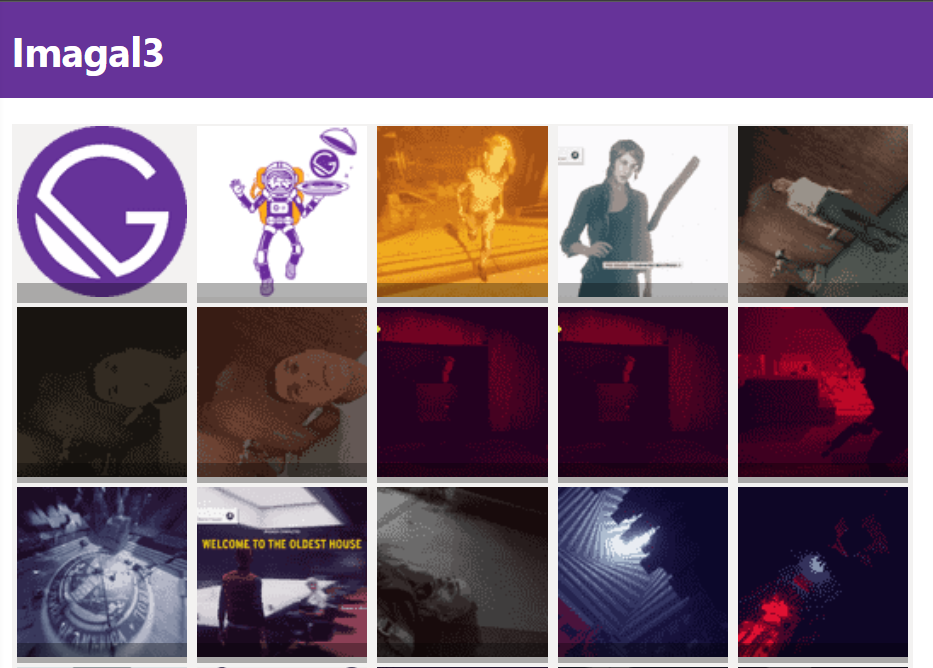

## IMAGAL3

This is the latest iteration of a project I have been trying to complete since 2010: a simple image gallery that can be used as the basis for experiments with large numbers of images or files. 

## Requirements
- Use Node 12 or 14
- Use `gatsby-cli@2.19.3`; Gatsby 3.x.x is not supported

## HOW TO USE
1. Clone repository; `cd` into `imagal3/`
1. Do `npm i`
1. Do `gatsby develop`

